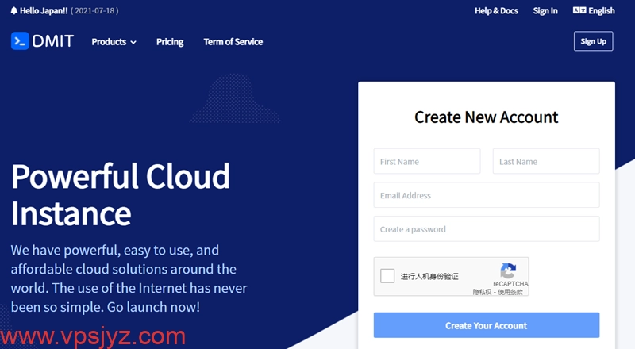

# DMIT日本/香港机房老用户直接送机器，CN2 GIA线路最高七折优惠

---

最近在找稳定的海外VPS？预算有限但又想要CN2 GIA线路？或者你需要大流量但不想超额付费？DMIT这次搞了个大动作——不仅给老用户直接送机器，新用户购买日本和香港机房也能享受最高七折优惠。对于需要稳定CN2 GIA线路或者大流量VPS的朋友来说，这可能是今年最值得关注的一次促销。

---

## 为什么DMIT这次要送机器？

说实话，这事儿有点意外。

最近DMIT遭遇了持续性的DDoS攻击，导致网络稳定性出了点问题。作为补偿，DMIT直接给老用户送机器——不是优惠券，不是积分，是实打实的VPS。

**具体怎么送？**

- 如果你账户里有**HKG Pro/HKG EB**或**TYO Pro/TYO EB**套餐，DMIT会送你一台原价45.9美元/年的**美国洛杉矶LAX.Pro.Echo**套餐
- 如果你有**HKG T1/TYO T1**套餐，会送你**美国洛杉矶LAX T1**套餐
- 送的机器到期时间跟你原有机器一致（Pro系列最多送一年，T1系列最多送三个月）
- 不用发工单，DMIT会在2025年11月15日前自动发放到账户

这种直接送机器的操作，在VPS行业里确实不多见。

## 这次优惠到底有多大？

除了给老用户送机器，DMIT这次对新老用户都有优惠，而且是**今年力度最大的一次**。

### 日本/香港T1系列：七折优惠

T1系列最大的特点是**流量用完后不限速继续用**——超出套餐流量后会降到100Mbps带宽，但不额外收费。对于流量需求大但预算有限的场景来说，这个套餐性价比极高。

**优惠码：** `202510_HKG_TYO_T1_30OFF_RECURRING`

**优惠幅度：** 季付及以上享受30%优惠（相当于七折）

**适用范围：** 香港T1和日本T1全系列套餐

这个系列的带宽是4Gbps，虽然不是CN2 GIA线路，但国际线路的速度也不慢。关键是流量用完后还能继续用，不用担心月底流量告急。

### 日本/香港Pro系列：八折优惠

Pro系列走的是**CN2 GIA线路**，这是目前访问中国大陆速度最快、最稳定的线路之一。如果你需要低延迟、高稳定性的VPS，这个系列是首选。

**优惠码：** `202510_HKG_TYO_PRO_20OFF_RECURRING`

**优惠幅度：** 季付及以上享受20%优惠（相当于八折）

**适用范围：** 香港Pro和日本Pro全系列套餐

**配置特点：**
- 1Gbps带宽
- 1个IPv4
- /64 IPv6
- CN2 GIA线路直连中国大陆

建议直接年付入手，性价比更高。

## DMIT到底怎么样？

说实话，DMIT在VPS圈子里算是老牌子了。他们最大的特点是**自建机房和线路**，不像很多小商家只是转售别人的资源。

**支付方式：**
- 支付宝
- 微信支付
- PayPal
- 信用卡

国内用户购买完全没有障碍。

**美国机房：** DMIT的美国数据中心有4个套餐——Lite、Premium、Premium Secure、Premium Unmetered。除了Lite是普通线路，其他都是CN2 GIA线路，但又细分为CN2 GIA标准版、CN2 GIA高防版和CN2 GIA不限流量版。

**为什么选DMIT？**

如果你需要稳定的香港CN2 GIA或日本CN2 GIA，或者需要便宜但速度快还无限流量的日本VPS和香港VPS，👉 [DMIT的这次促销活动](https://www.dmit.io/aff.php?aff=13832)确实值得关注。毕竟自建机房和线路的商家，在网络质量上确实有保障。

## 该选T1还是Pro？

这个问题取决于你的实际需求。

**选T1系列如果：**
- 你的流量需求很大（比如做下载站、图床、视频站）
- 你预算有限但需要稳定的海外节点
- 你不太在意延迟，更看重性价比

T1系列流量用完后会降到100Mbps带宽继续用，等于变相的无限流量。对于大流量场景来说，这个设计非常实用。

**选Pro系列如果：**
- 你需要低延迟（比如做代理、游戏加速）
- 你的用户主要在中国大陆
- 你对网络稳定性要求高

CN2 GIA线路在访问中国大陆时的表现确实比普通国际线路好很多，延迟低、丢包少、晚高峰也稳定。

## 优惠截止时间

**2025年10月20日**

如果你正好需要海外VPS，这次促销确实是个不错的机会。毕竟DMIT一年也就搞几次大促销，而且这次是今年力度最大的一次。

---

总结一下：DMIT这次促销包括老用户送机器、T1系列七折、Pro系列八折，优惠截止到10月20日。如果你需要稳定的香港CN2 GIA、日本CN2 GIA，或者需要大流量但预算有限的VPS，👉 [现在入手DMIT](https://www.dmit.io/aff.php?aff=13832)确实是个不错的时机。支持支付宝和微信支付，国内用户购买也很方便。
